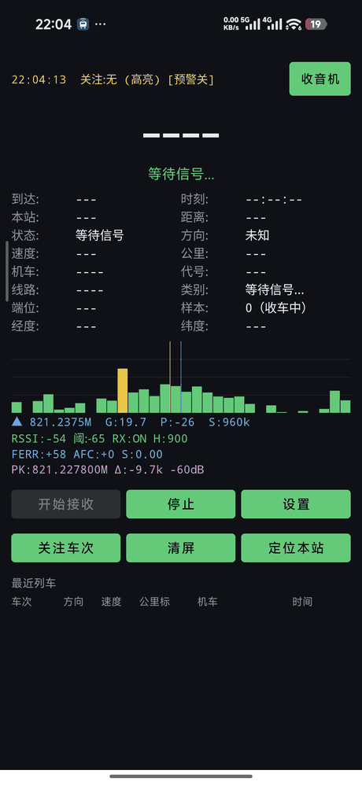
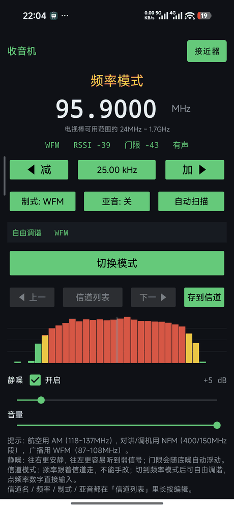
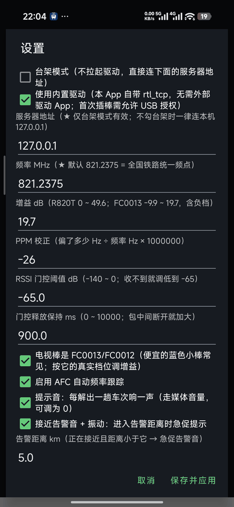

# LBJ Receiver（Android）

用一根几十块的 **RTL-SDR 电视棒**，在手机上接收并解码**铁路列车接近预警（LBJ）报文**，
顺便也能当一台**全频段收音机 / 扫描器**用。

- 纯手机独立运行：电视棒插 OTG，不需要电脑、不需要外网、**不依赖 Google 服务**
- 内置 rtl_tcp（自己起驱动），也可以走【台架模式】连外部服务器 —— 协议见 [docs/BENCH_MODE.md](docs/BENCH_MODE.md)
- 解码链路（DDC → 信道滤波 → FM 鉴频 → AFC → DPLL 时钟恢复 → POCSAG → BCH 纠错 → LBJ 报文解析）
  沿用上游实现，本项目负责 Android 侧集成、界面与工程化
- 收音机模式：NFM / AM / WFM、静噪、信道列表、自动扫描、录音级音频链

> ⚠ 仅用于**接收**公开无线电信号与学习 SDR/POCSAG 解码，禁止用于任何非法用途。

## 界面

| 列车预警接收 | 收音机 / 扫描器 | 设置 |
|---|---|---|
|  |  |  |

> 真机截图：左图 821.2375 MHz 接收中（频谱里那根黄柱是 RTL-SDR 的直流尖峰，属正常现象）；
> 中图是收音机模式收到本地 FM 广播；右图是设置页。

## 环境要求

| 项目 | 要求 |
|---|---|
| 手机 | Android 8.0（API 26）以上，**arm64-v8a** |
| 电视棒 | RTL2832U（0bda:2832）系列，如 RTL-SDR Blog V3、常见蓝色小棒（FC0013/FC0012 调谐器） |
| 连接 | USB-OTG 转接头；首次插入需要在系统弹窗里允许 USB 权限 |
| 定位 | 只用系统 AOSP 定位（**不需要 Google 服务**），用于把公里标对上线路 |

## 安装

去 [Releases](../../releases) 下载 `LBJReceiver-<版本>-arm64.apk` 直接安装。

## 从源码构建

需要 JDK 17、Android SDK 34、NDK、以及一个本机 Python 3.12（Chaquopy 用它装 numpy）。

```bash
git clone <本仓库>
cd LBJReceiver
cp keystore.properties.example keystore.properties   # 可选：没有则 release 用 debug 签名
echo "buildPython=C:/path/to/python.exe" >> local.properties
./gradlew :app:assembleRelease
```

- `local.properties`（SDK 路径、本机 Python）与 `keystore.properties`（签名）**都不入库**，见 `.gitignore`
- 没有签名文件也能构建，只是产物是 debug 签名

## 用法

1. 电视棒插上手机 → 允许 USB 授权 → 点【开始接收】
2. 频率默认 **821.2375 MHz**（全国铁路统一频点），一般不用改
3. 想听广播/对讲就点右上角【收音机】，可切 NFM/AM/WFM
4. 【台架模式】是给测试用的：不拉起任何驱动，直接连一台 rtl_tcp 兼容服务器（默认 `127.0.0.1`，端口固定 1234）

## 本机实测数据

以下都是**这一台设备**（Xiaomi 2510DRK44C / Android 16，RTL2832U + **Fitipower FC0013**）上的实测值，
不是理论值。它同时解释了默认设置为什么是现在这样。

**频率与采样**

| 项目 | 值 |
|---|---|
| 目标频率 | 821.2375 MHz（铁路 LBJ） |
| 采样率 | 960 kS/s |
| 解调带宽 | 35 kHz |
| DC 避让 | 硬件中心 = 目标 − 50 kHz |
| PPM 校正 | **−26**（本机晶振偏快；填正号会偏得更远） |

**FC0013 增益：AGC 没有收益（30 秒积分量 CNR，信号是 95.9 MHz 的极弱广播台）**

| 增益 | CNR | 电平 | 削顶 |
|---|---|---|---|
| −9.9 dB | 3.18 dB | −43.0 dBFS | 0 |
| 5.8 dB | 3.61 | −39.7 | 0 |
| 7.1 dB | 3.60 | −37.7 | 0 |
| 17.9 dB | 4.11 | −30.7 | 0 |
| **19.7 dB（默认）** | 3.68 | −26.2 | 0 |
| **自动增益（AGC）** | **3.43** | **−6.5** | **4.10%** |

结论：**AGC 三轮测量都是最低**，只把电平抬高 20 dB、削顶 4%，没有任何 CNR 收益；
手动档里 17.9~19.7 分不出高下（跑批重复性 ±0.5 dB），低档（−9.9/5.8/7.1）明显更差。
所以**默认手动 19.7 dB，不提供 AGC 选项**（曾经加过，实测后删掉了）。

**台架模式实测**（电脑插棒 + Wi-Fi 转发给手机）

| 项目 | 值 |
|---|---|
| 服务端 | `rtl_tcp -a 0.0.0.0 -p 1234`（电脑端） |
| 手机端 | 台架模式 → `192.168.0.199:1234`，`ESTABLISHED` |
| 采样 | 960 kS/s，约 1.8 MB/s，Wi-Fi 无压力 |
| 结果 | 手机可直接解调、收音机出声（实测 FM 95.9 正常收听） |

## 许可

**GPL-3.0-or-later**（见 [LICENSE](LICENSE)）—— 因为本项目链接/包含了 GPL 组件，整个 APK 属于
GPL 衍生作品，这是硬性要求而非选择。第三方组件的版权与许可见 [THIRD_PARTY.md](THIRD_PARTY.md)。

特别致谢：

- **Sdr-Is-Fun** —— [RTL_SDR_LBJ_RECEIVER](https://github.com/Sdr-Is-Fun/RTL_SDR_LBJ_RECEIVER)：
  本项目的解码核心 `app/src/main/python/lbj_ref.py` 就是它的 `rtl_sdr_lbj_receiver.py` **原文照搬**
- 该项目又参考了 **FLN1021/SX1276_Receive_LBJ**
- **Signalware Ltd**（SDR Touch 驱动模块）、**Steve Markgraf / Dimitri Stolnikov**（librtlsdr）、libusb 项目

作者：[@Scorpio-yzy](https://github.com/Scorpio-yzy)　仓库：https://github.com/Scorpio-yzy/LBJReceiver

## 免责声明

本项目按"原样"提供，不提供任何担保。仅限学习 SDR 接收链路与 POCSAG 解码，
以及接收公开广播信号使用。请遵守当地无线电管理法规。
